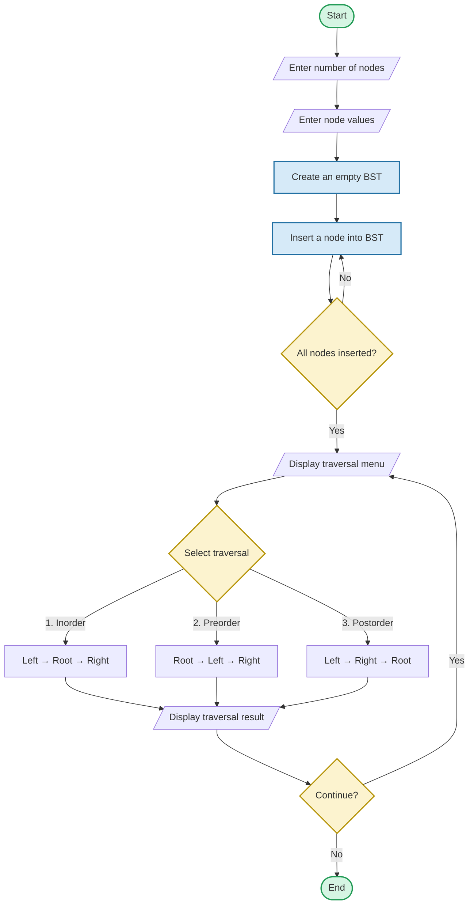

# BST Construction and Traversal – Flowchart

```mermaid
flowchart TD
    A([Start]) --> B[/Enter number of nodes/]
    B --> C[/Enter node values/]
    C --> D[Create an empty BST]
    D --> E[Insert a node into BST]
    E --> F{All nodes inserted?}

    F -->|No| E
    F -->|Yes| G[/Display traversal menu/]

    G --> H{Select traversal}

    H -->|1. Inorder| I[Left → Root → Right]
    H -->|2. Preorder| J[Root → Left → Right]
    H -->|3. Postorder| K[Left → Right → Root]

    I --> L[/Display traversal result/]
    J --> L
    K --> L

    L --> M{Continue?}
    M -->|Yes| G
    M -->|No| N([End])

    style A fill:#d5f5e3,stroke:#239b56,stroke-width:2px
    style N fill:#d5f5e3,stroke:#239b56,stroke-width:2px
    style F fill:#fcf3cf,stroke:#b7950b,stroke-width:2px
    style H fill:#fcf3cf,stroke:#b7950b,stroke-width:2px
    style M fill:#fcf3cf,stroke:#b7950b,stroke-width:2px
    style D fill:#d6eaf8,stroke:#2874a6,stroke-width:2px
    style E fill:#d6eaf8,stroke:#2874a6,stroke-width:2px
```
